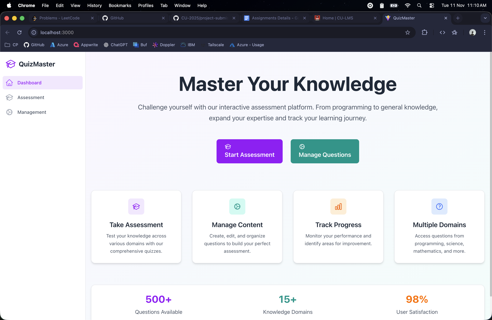
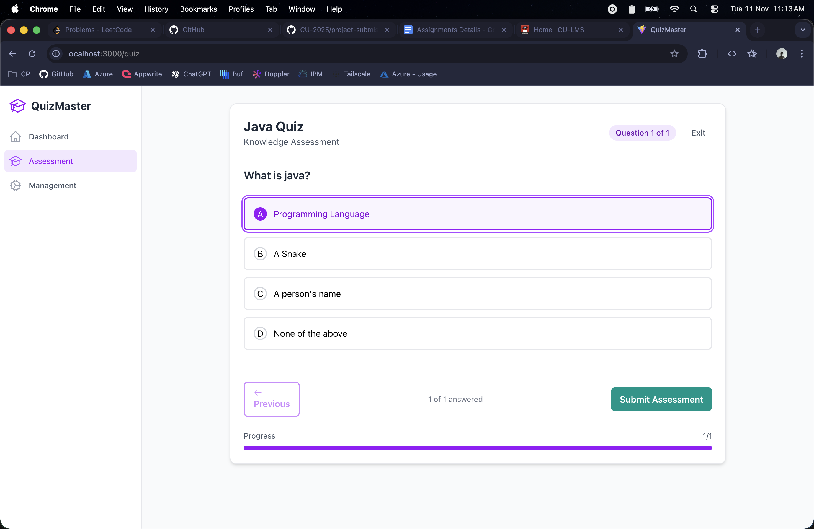
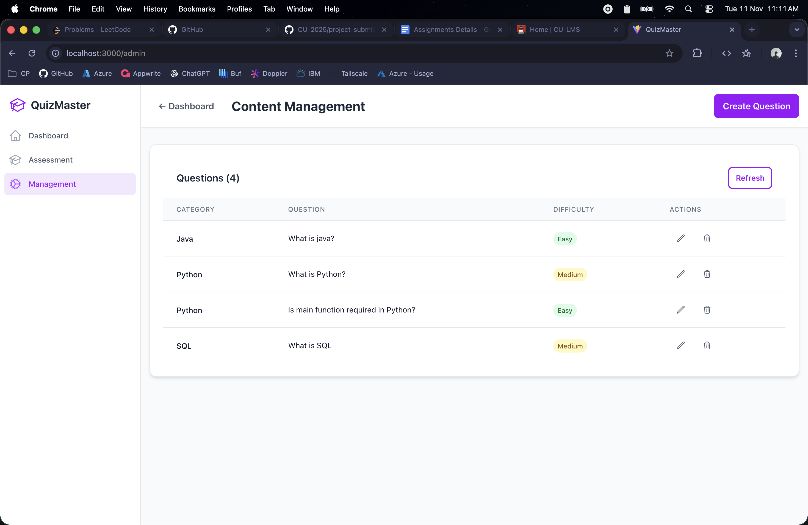
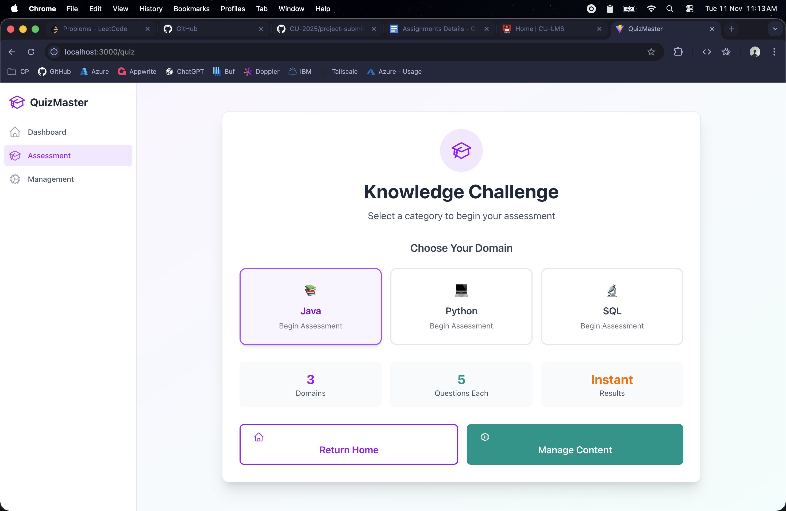
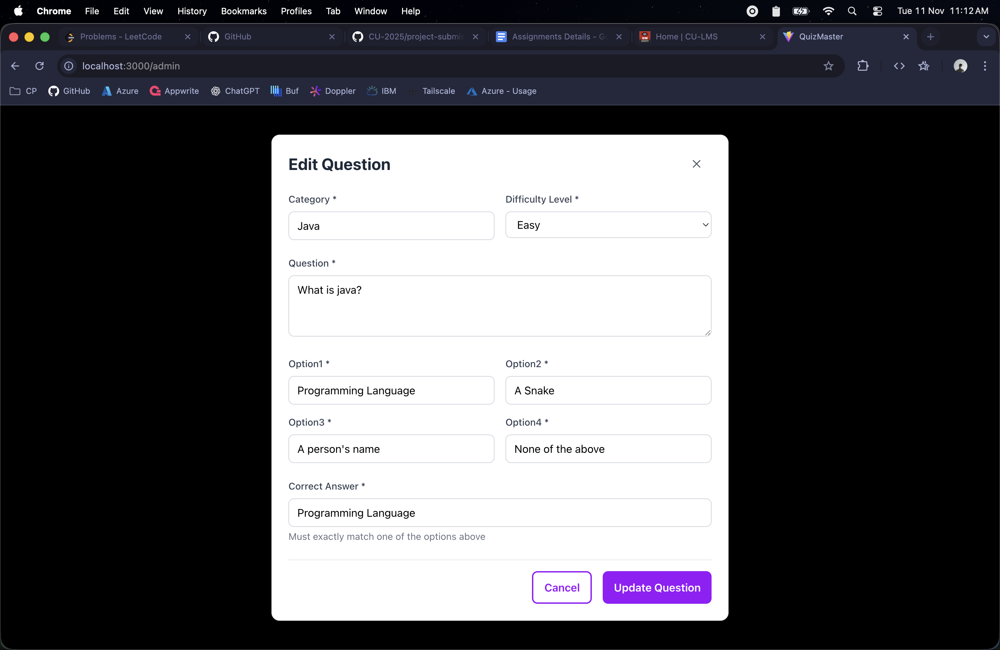
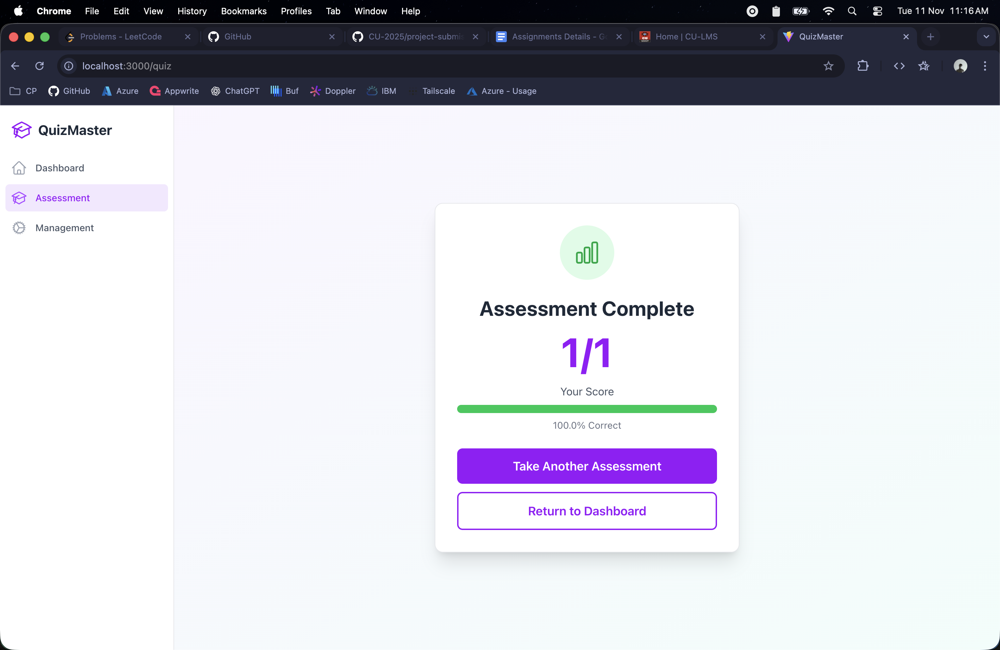

# QuizMaster – Full Stack Project
A full-stack quiz app built using Spring Boot (backend) and React.js (frontend). It allows users to take category-based quizzes, view scores instantly, and provides admin controls to manage questions and categories.

## Author
- Vanshit Kumar
- UID: 23BCS10087
- Section: KRG_1A

## Project Structure
project/<br/>
├─ frontend-react/<br/>
├─ backend-springboot/

## Features
### User Features
- Attempt quizzes by category
- Navigate between questions freely
- Instant score calculation after submission

### Admin Features
- Add, update, and delete quiz questions
- Create and manage categories
- View all quizzes and question details

## Tech Stack
- Frontend: React.js, HTML, CSS, JavaScript
- Backend: Spring Boot, Java, REST API
- Database: MySQL
- Build Tools: Maven (backend), npm (frontend)
- Version Control: Git & GitHub

## How to Run Locally

### Backend
```bash
cd backend
sudo service mariadb start   # Start Mysql server
# Make sure database configurations in application.properties are correct
mvn spring-boot:run
```
Server will start at:
http://localhost:8080

### Frontend
```bash
cd frontend
npm install
npm run dev
```

Frontend server runs on:
http://localhost:3000

## Key Functionalities
- RESTful API communication between backend and frontend
- Dynamic rendering of quiz data
- Real-time result calculation
- Modular and scalable architecture

## Working Screenshots
### Home Page

### Quiz Taking Interface

### Question Management

### Assessments Overview

### Question creation/edition

### Instant Results


[](https://classroom.github.com/a/NyU_7VRM)
